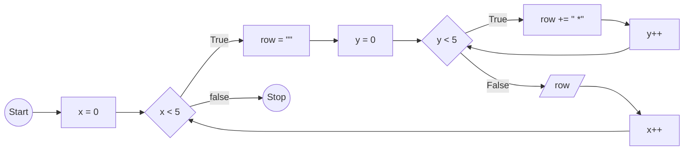
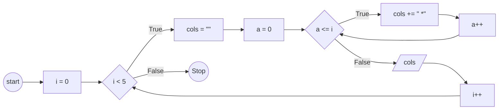
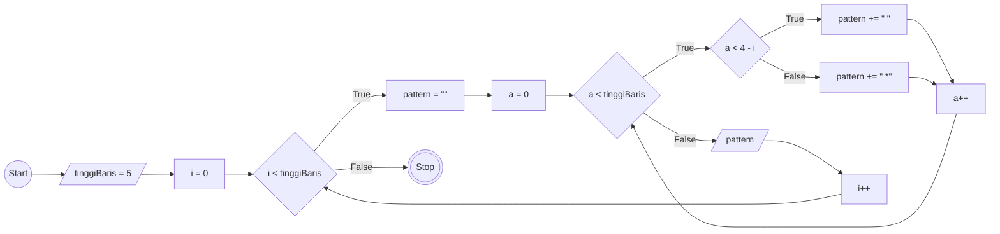
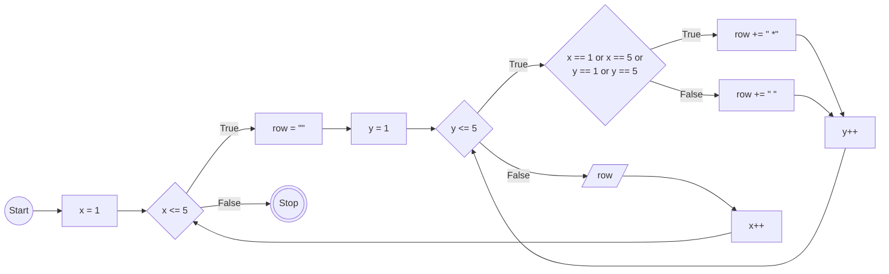

# Membuat perulangan di javascript menggunakan for

## Program pertama

```mermaid
    flowchart LR
    A((Start))
    B[x = 0]
    C{x < 5}
    D[row = #quot;#quot;]
    E[y = 0]
    F{y < 5}
    G[row += #quot; *#quot;]
    H[y++]
    I[/row/]
    J[x++]
    X((Stop))

    A --> B
    B --> C
    C -- True --> D
    D --> E
    E --> F
    F -- True --> G
    G --> H
    H --> F
    F -- False --> I
    I --> J
    J --> C
    C -- false --> X
```

## Program kedua

```mermaid
    flowchart LR
    A((start))
    B[i = 0]
    C{i < 5}
    D[cols = #quot;#quot;]
    E[a = 0]
    F{a <= i}
    G[cols += #quot; *#quot;]
    H[a++]
    I[/cols/]
    J[i++]
    X((Stop))

    A --> B
    B --> C
    C -- True --> D
    D --> E
    E --> F
    F -- True --> G
    G --> H
    H --> F
    F -- False --> I
    I --> J
    J --> C
    C -- False --> X
```

## Program ketiga

```mermaid
    flowchart LR
    A((Start))
    B[/tinggiBaris = 5/]
    C[i = 0]
    D{i < tinggiBaris}
    E[pattern = #quot;#quot;]
    F[a = 0]
    G{a < tinggiBaris}
    I{a < 4 - i}
    J[pattern += #quot; #quot;]
    K[pattern += #quot; *#quot;]
    L[a++]
    M[/pattern/]
    N[i++]
    X(((Stop)))

    A --> B --> C
    C --> D
    D -- True --> E
    E --> F
    F --> G
    G -- True --> I
    I -- True --> J --> L
    I -- False --> K --> L
    L --> G
    G -- False --> M
    M --> N
    N --> D
    D -- False --> X
```

## Program keempat

```mermaid
    flowchart LR
    A((Start))
    B[x = 1]
    C{x <= 5}
    D[row = #quot;#quot;]
    E[y = 1]
    F{y <= 5}
    G{x == 1 or x == 5 or
    y == 1 or y == 5}
    H[row += #quot; *#quot;]
    I[row += #quot;  #quot;]
    J[y++]
    K[x++]
    L[/row/]
    X(((Stop)))

    A --> B --> C
    C -- True --> D --> E
    E --> F
    F -- True --> G
    G -- True --> H --> J
    G -- False --> I --> J
    J --> F
    F -- False --> L
    L --> K
    K --> C
    C -- False --> X
```
